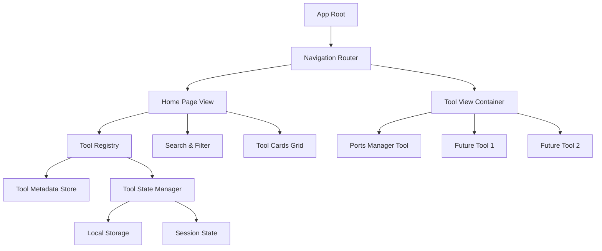

# Dev Tools Dashboard - Design Document

## Overview

The Dev Tools Dashboard transforms the single-purpose Local Ports Manager into a multi-tool development platform. It provides a unified home page where developers can access multiple development utilities through an intuitive card-based interface. The design emphasizes extensibility, allowing new tools to be easily added to the platform while maintaining isolated state for each tool.

The architecture follows a hub-and-spoke model where the dashboard acts as the central hub, and individual tools (like the Ports Manager) are spokes that can be navigated to and from. This design ensures that the existing Ports Manager functionality remains intact while being integrated into a larger ecosystem.

Key design principles:

- **Extensibility**: New tools can be added without modifying existing tool code
- **State Isolation**: Each tool maintains its own state independently
- **Performance**: Fast navigation and responsive UI with transitions under 300ms
- **Accessibility**: Full keyboard navigation and reduced motion support
- **Persistence**: User preferences and tool states survive application restarts

## Architecture

### High-Level Architecture



### Component Hierarchy

The application follows a layered architecture:

1. **Application Layer**: Root component managing global state and routing
2. **Navigation Layer**: Handles view transitions and breadcrumb navigation
3. **Home Page Layer**: Tool discovery, search, filtering, and organization
4. **Tool Container Layer**: Wraps individual tools and manages their lifecycle
5. **Tool Layer**: Individual development tools (Ports Manager, etc.)

### State Management Strategy

The design uses a hybrid state management approach:

- **Global State**: Navigation state, tool registry, user preferences (pinned tools, recently used)
- **Tool-Specific State**: Each tool manages its own state independently
- **Persistent State**: User preferences and critical tool state stored in localStorage
- **Session State**: Temporary state that doesn't need persistence (search queries, filters)

## Components and Interfaces

### Core Components

#### 1. DashboardApp (Root Component)

**Responsibilities**:

- Initialize tool registry
- Manage global navigation state
- Provide keyboard shortcut handlers
- Coordinate state persistence

**Interface**:

```typescript
interface DashboardAppProps {
  initialRoute?: string;
}

interface DashboardAppState {
  currentView: "home" | "tool";
  activeToolId: string | null;
  toolStates: Map<string, unknown>;
}
```

#### 2. NavigationRouter

**Responsibilities**:

- Route between home page and tool views
- Manage navigation history
- Handle transitions and animations
- Provide navigation context to child components

**Interface**:

```typescript
interface NavigationContext {
  navigateToHome: () => void;
  navigateToTool: (toolId: string) => void;
  currentView: "home" | "tool";
  activeToolId: string | null;
  canGoBack: boolean;
}

interface NavigationRouterProps {
  onNavigate?: (view: string, toolId?: string) => void;
  transitionDuration?: number; // default 300ms
  enableTransitions?: boolean;
}
```

#### 3. HomePage

**Responsibilities**:

- Display tool cards in responsive grid
- Manage search and filtering
- Show pinned and recently used sections
- Handle tool card interactions

**Interface**:

```typescript
interface HomePageProps {
  tools: Tool[];
  pinnedToolIds: string[];
  recentlyUsedToolIds: string[];
  onToolSelect: (toolId: string) => void;
  onToolPin: (toolId: string) => void;
  onToolUnpin: (toolId: string) => void;
}

interface HomePageState {
  searchQuery: string;
  selectedCategory: string;
  filteredTools: Tool[];
}
```

#### 4. ToolCard

**Responsibilities**:

- Display tool metadata (icon, name, description)
- Show status badges and notifications
- Handle click and context menu interactions
- Display hover tooltips

**Interface**:

```typescript
interface ToolCardProps {
  tool: Tool;
  isPinned: boolean;
  isRecentlyUsed: boolean;
  status?: ToolStatus;
  notificationCount?: number;
  onSelect: () => void;
  onPin: () => void;
  onUnpin: () => void;
}

interface ToolStatus {
  state: "idle" | "active" | "warning" | "error";
  message?: string;
}
```

#### 5. ToolViewContainer

**Responsibilities**:

- Wrap individual tool components
- Manage tool lifecycle (mount/unmount)
- Preserve and restore tool state
- Provide breadcrumb navigation

**Interface**:

```typescript
interface ToolViewContainerProps {
  toolId: string;
  tool: Tool;
  initialState?: unknown;
  onStateChange: (state: unknown) => void;
  onNavigateHome: () => void;
}
```

#### 6. SearchBar

**Responsibilities**:

- Accept user search input
- Debounce search queries
- Clear search functionality

**Interface**:

```typescript
interface SearchBarProps {
  value: string;
  onChange: (query: string) => void;
  onClear: () => void;
  placeholder?: string;
  debounceMs?: number; // default 100ms
}
```

#### 7. CategoryFilter

**Responsibilities**:

- Display category buttons
- Show tool counts per category
- Handle category selection

**Interface**:

```typescript
interface CategoryFilterProps {
  categories: Category[];
  selectedCategory: string;
  onCategorySelect: (categoryId: string) => void;
}

interface Category {
  id: string;
  name: string;
  toolCount: number;
}
```

#### 8. BreadcrumbNavigation

**Responsibilities**:

- Display current location
- Provide navigation back to home
- Show tool name when in tool view

**Interface**:

```typescript
interface BreadcrumbNavigationProps {
  currentView: "home" | "tool";
  toolName?: string;
  onNavigateHome: () => void;
}
```

### Tool Registry System

#### ToolRegistry

**Responsibilities**:

- Maintain list of available tools
- Provide tool metadata
- Support dynamic tool registration
- Manage tool categories

**Interface**:

```typescript
interface Tool {
  id: string;
  name: string;
  description: string;
  icon: string; // Icon component name or path
  category: string[];
  component: React.ComponentType<ToolComponentProps>;
  features?: string[]; // For tooltips
  version?: string;
}

interface ToolRegistry {
  registerTool(tool: Tool): void;
  unregisterTool(toolId: string): void;
  getTool(toolId: string): Tool | undefined;
  getAllTools(): Tool[];
  getToolsByCategory(category: string): Tool[];
  searchTools(query: string): Tool[];
}

interface ToolComponentProps {
  // Standard props passed to all tool components
  isActive: boolean;
  onStateChange?: (state: unknown) => void;
  initialState?: unknown;
}
```

### State Management Interfaces

#### UserPreferences

```typescript
interface UserPreferences {
  pinnedTools: string[]; // max 6
  recentlyUsedTools: string[]; // max 3
  enableTransitions: boolean;
  reducedMotion: boolean;
  lastActiveToolId?: string;
}
```

#### ToolStateManager

```typescript
interface ToolStateManager {
  saveToolState(toolId: string, state: unknown): void;
  loadToolState(toolId: string): unknown | undefined;
  clearToolState(toolId: string): void;
  persistState(): Promise<void>;
  restoreState(): Promise<void>;
}
```

## Data Models

### Tool Model

```typescript
interface Tool {
  id: string; // Unique identifier (e.g., 'ports-manager')
  name: string; // Display name (e.g., 'Local Ports Manager')
  description: string; // Short description for card
  icon: string; // Icon identifier
  category: string[]; // Categories (e.g., ['networking', 'monitoring'])
  component: React.ComponentType<ToolComponentProps>;
  features?: string[]; // Key features for tooltip
  version?: string; // Tool version
  metadata?: Record<string, unknown>; // Additional metadata
}
```

### Navigation State Model

```typescript
interface NavigationState {
  currentView: "home" | "tool";
  activeToolId: string | null;
  history: NavigationHistoryEntry[];
  transitionInProgress: boolean;
}

interface NavigationHistoryEntry {
  view: "home" | "tool";
  toolId?: string;
  timestamp: number;
}
```

### Tool Status Model

```typescript
interface ToolStatus {
  toolId: string;
  state: "idle" | "active" | "warning" | "error";
  message?: string;
  notificationCount?: number;
  lastUpdated: number;
}
```

### User Preferences Model

```typescript
interface UserPreferences {
  pinnedTools: string[]; // Array of tool IDs (max 6)
  recentlyUsedTools: RecentTool[]; // Array of recent tools (max 3)
  enableTransitions: boolean;
  reducedMotion: boolean;
  lastActiveToolId?: string;
  searchHistory?: string[]; // Optional: recent searches
}

interface RecentTool {
  toolId: string;
  lastAccessedAt: number;
}
```

### Category Model

```typescript
interface Category {
  id: string; // e.g., 'networking', 'api', 'database'
  name: string; // Display name
  description?: string;
  icon?: string;
}
```

## Correctness Properties

_A property is a characteristic or behavior that should hold true across all valid executions of a system—essentially, a formal statement about what the system should do. Properties serve as the bridge between human-readable specifications and machine-verifiable correctness guarantees._
crea

### Pr

operty Reflection

After analyzing all acceptance criteria, several properties can be consolidated:

**Redundancies Identified**:

1. Properties 3.1 and 3.4 both test navigation to home (via button vs breadcrumb) - can be combined into one property about home navigation
2. Properties 11.1 and 11.2 both test state preservation when switching tools - these are the same property from different perspectives
3. Properties 11.4 and 11.5 form a round-trip property for persistence - can be combined

**Consolidated Properties**:

- Home navigation (3.1, 3.4) → Single property: "Any navigation action to home returns to home page"
- Tool state preservation (11.1, 11.2) → Single property: "Switching between tools preserves state"
- State persistence round-trip (11.4, 11.5) → Single property: "State persistence round-trip preserves critical state"

### Properties

Property 1: Tool card rendering completeness
_For any_ tool in the registry, when rendered as a card, the card component should contain the tool's icon, name, and description
**Validates: Requirements 1.2**

Property 2: Tool card click navigation
_For any_ tool card, clicking it should trigger navigation to that tool's view with the correct tool ID
**Validates: Requirements 2.1**

Property 3: Home page visibility during tool view
_For any_ tool view, when that tool is active, the home page component should not be rendered
**Validates: Requirements 2.2**

Property 4: Tool component rendering
_For any_ tool, when navigating to that tool's view, the tool's component should be rendered and receive the correct props
**Validates: Requirements 2.3**

Property 5: Navigation controls presence
_For any_ active tool view, the navigation UI should include either a back button or home button
**Validates: Requirements 2.5**

Property 6: Home navigation from any view
_For any_ navigation action to home (button click, breadcrumb click, keyboard shortcut), the dashboard should navigate to the home page
**Validates: Requirements 3.1, 3.4**

Property 7: Tool state preservation during navigation
_For any_ tool with state, when navigating away from that tool and then back to it, the tool's state should be identical to its state before navigation
**Validates: Requirements 3.2, 11.1, 11.2**

Property 8: Breadcrumb tool name display
_For any_ active tool, the breadcrumb navigation should display that tool's name
**Validates: Requirements 3.3**

Property 9: Keyboard shortcut home navigation
_For any_ view state, when the Cmd/Ctrl+H keyboard shortcut is triggered, the dashboard should navigate to the home page
**Validates: Requirements 3.5**

Property 10: Status badge display for active tools
_For any_ tool with an active, warning, or error status, the tool card should display a status badge
**Validates: Requirements 4.1**

Property 11: Notification badge display
_For any_ tool with a notification count greater than zero, the tool card should display a notification count badge with the correct number
**Validates: Requirements 4.2**

Property 12: Status badge reactivity
_For any_ tool, when its status changes, the tool card's status badge should update to reflect the new status within the next render cycle
**Validates: Requirements 4.3**

Property 13: Status badge color mapping
_For any_ tool with a status badge, the badge color should correspond to the status type (active → blue, warning → yellow, error → red)
**Validates: Requirements 4.4**

Property 14: Recently used indicator display
_For any_ tool in the recently used list, the tool card should display a recently used indicator
**Validates: Requirements 4.5**

Property 15: Search filtering correctness
_For any_ search query, all displayed tool cards should have either their name or description containing the search query (case-insensitive)
**Validates: Requirements 5.2**

Property 16: Search clear shows all tools
_For any_ dashboard state, when the search query is cleared (empty string), all registered tools should be displayed
**Validates: Requirements 5.5**

Property 17: Tool category assignment
_For any_ tool in the registry, the tool should have at least one category assigned
**Validates: Requirements 6.1**

Property 18: Category filtering correctness
_For any_ selected category (excluding "All"), all displayed tools should belong to that category
**Validates: Requirements 6.3**

Property 19: Category tool count accuracy
_For any_ category, the displayed tool count should equal the number of tools that belong to that category
**Validates: Requirements 6.5**

Property 20: Recently used recording
_For any_ tool, when that tool is opened, it should be added to the recently used list
**Validates: Requirements 7.1**

Property 21: Recently used display limit
_For any_ dashboard state with recently used tools, the recently used section should display at most 3 tools, ordered by most recent access
**Validates: Requirements 7.3**

Property 22: Recently used persistence round-trip
_For any_ set of recently used tools, after persisting to storage and restoring (simulating app restart), the recently used list should contain the same tools in the same order
**Validates: Requirements 7.4**

Property 23: Clear recently used history
_For any_ dashboard state, when the clear history action is triggered, the recently used list should become empty
**Validates: Requirements 7.5**

Property 24: Context menu pin option
_For any_ tool card, when right-clicked, a context menu should appear containing a "Pin" or "Unpin" option (depending on current pin state)
**Validates: Requirements 8.1**

Property 25: Pin tool adds to pinned section
_For any_ unpinned tool, when pinned, the tool should appear in the pinned tools section
**Validates: Requirements 8.2**

Property 26: Pinned tools persistence round-trip
_For any_ set of pinned tools, after persisting to storage and restoring (simulating app restart), the pinned tools list should contain the same tools
**Validates: Requirements 8.3**

Property 27: Unpin removes from pinned section
_For any_ pinned tool, when unpinned, the tool should be removed from the pinned tools section
**Validates: Requirements 8.4**

Property 28: Pin limit enforcement
_For any_ dashboard state, the number of pinned tools should never exceed 6, and attempts to pin beyond this limit should be rejected or require unpinning another tool
**Validates: Requirements 8.5**

Property 29: Navigation blocking during transitions
_For any_ navigation transition in progress, additional navigation actions should be blocked or queued until the transition completes
**Validates: Requirements 9.3**

Property 30: Reduced motion disables transitions
_For any_ navigation action, when reduced motion is enabled in preferences, transitions should be disabled or use instant changes
**Validates: Requirements 9.5**

Property 31: Tab navigation between tool cards
_For any_ home page state, pressing Tab should move focus to the next tool card in sequence
**Validates: Requirements 10.1**

Property 32: Enter key opens focused tool
_For any_ tool card with focus, pressing Enter should navigate to that tool's view
**Validates: Requirements 10.2**

Property 33: Escape key returns to home
_For any_ tool view, pressing Escape should navigate back to the home page
**Validates: Requirements 10.3**

Property 34: Focus indicator visibility
_For any_ interactive element with focus, a visible focus indicator should be present in the rendered output
**Validates: Requirements 10.4**

Property 35: Arrow key navigation in grid
_For any_ focused tool card, pressing arrow keys should move focus to adjacent tool cards in the grid (up/down/left/right)
**Validates: Requirements 10.5**

Property 36: Session state maintenance
_For any_ tool accessed during a session, the tool's state should be maintained in memory for the duration of the session
**Validates: Requirements 11.3**

Property 37: State persistence round-trip
_For any_ tool with critical state, after persisting on app close and restoring on app open, the tool's critical state should be preserved
**Validates: Requirements 11.4, 11.5**

Property 38: Tooltip display on hover
_For any_ tool card, when hovered, a tooltip should be displayed containing additional information about the tool
**Validates: Requirements 12.1**

Property 39: Tooltip content includes features
_For any_ tool with defined features, the tooltip should include those features in its content
**Validates: Requirements 12.3**

Property 40: Tooltip boundary constraint
_For any_ tooltip, the tooltip's position should be adjusted so that it remains fully within the window boundaries
**Validates: Requirements 12.5**

## Error Handling

### Navigation Errors

**Invalid Tool ID Navigation**:

- When attempting to navigate to a non-existent tool ID, the dashboard should:
  1. Log an error to the console
  2. Display a user-friendly error message
  3. Redirect to the home page
  4. Optionally show a toast notification: "Tool not found"

**Tool Component Load Failure**:

- When a tool component fails to load or mount:
  1. Catch the error using React Error Boundary
  2. Display an error state in the tool view container
  3. Provide a "Return to Home" button
  4. Log the error with stack trace for debugging
  5. Optionally allow retry

### State Management Errors

**State Persistence Failure**:

- When localStorage is unavailable or quota exceeded:
  1. Log a warning
  2. Continue operation with in-memory state only
  3. Display a warning banner: "Preferences won't be saved"
  4. Gracefully degrade to session-only state

**State Restoration Failure**:

- When restoring state from storage fails (corrupted data):
  1. Log the error
  2. Clear the corrupted state
  3. Initialize with default state
  4. Continue normal operation

**Tool State Serialization Error**:

- When a tool's state cannot be serialized:
  1. Log a warning with tool ID
  2. Skip persisting that tool's state
  3. Continue persisting other tools' states
  4. Notify tool developer (console warning)

### Search and Filter Errors

**Search Query Processing Error**:

- When search query contains invalid regex characters:
  1. Escape special characters automatically
  2. Continue with escaped query
  3. No user-facing error (transparent handling)

**Category Filter Error**:

- When filtering by a non-existent category:
  1. Fall back to "All" category
  2. Log a warning
  3. Update UI to show "All" as selected

### User Interaction Errors

**Pin Limit Exceeded**:

- When attempting to pin more than 6 tools:
  1. Prevent the pin action
  2. Display a toast notification: "Maximum 6 pinned tools. Unpin one first."
  3. Optionally highlight the pinned tools section

**Context Menu Error**:

- When context menu fails to open:
  1. Log the error
  2. Fall back to showing pin/unpin button in card hover state
  3. Continue normal operation

### Tool Registry Errors

**Duplicate Tool Registration**:

- When attempting to register a tool with an existing ID:
  1. Throw an error in development mode
  2. Log a warning in production
  3. Reject the registration
  4. Keep the existing tool

**Invalid Tool Registration**:

- When tool metadata is missing required fields:
  1. Throw an error with details of missing fields
  2. Reject the registration
  3. Provide clear error message for developers

## Testing Strategy

The Dev Tools Dashboard will employ a comprehensive testing strategy combining unit tests, integration tests, and property-based tests to ensure correctness and reliability.

### Unit Testing

Unit tests will verify specific behaviors and edge cases for individual components and utilities:

**Component Tests**:

- ToolCard: rendering with various props, click handlers, context menu
- SearchBar: input handling, debouncing, clear functionality
- CategoryFilter: button rendering, selection handling, counts
- BreadcrumbNavigation: display logic, click handlers
- NavigationRouter: route matching, transition states

**Service Tests**:

- ToolRegistry: registration, retrieval, search, category filtering
- ToolStateManager: save, load, clear, persistence
- UserPreferences: get, set, validation, defaults

**Edge Cases**:

- Empty tool registry
- Search with no results
- Maximum pinned tools (6)
- Maximum recently used tools (3)
- Invalid tool IDs
- Corrupted localStorage data
- Missing tool metadata

**Testing Framework**: Vitest with React Testing Library

### Property-Based Testing

Property-based tests will verify universal properties across many randomly generated inputs. Each property test will run a minimum of 100 iterations.

**Property Testing Library**: fast-check (for TypeScript/JavaScript)

**Key Properties to Test**:

1. **Tool Card Rendering** (Property 1)

   - Generate random tool metadata
   - Verify card contains icon, name, description
   - **Feature: dev-tools-dashboard, Property 1: Tool card rendering completeness**

2. **Search Filtering** (Property 15)

   - Generate random tool sets and search queries
   - Verify all results match the query
   - **Feature: dev-tools-dashboard, Property 15: Search filtering correctness**

3. **Category Filtering** (Property 18)

   - Generate random tool sets with categories
   - Verify filtered results belong to selected category
   - **Feature: dev-tools-dashboard, Property 18: Category filtering correctness**

4. **State Preservation** (Property 7)

   - Generate random tool states
   - Navigate away and back
   - Verify state is identical
   - **Feature: dev-tools-dashboard, Property 7: Tool state preservation during navigation**

5. **Persistence Round-Trip** (Properties 22, 26, 37)

   - Generate random preferences and tool states
   - Persist and restore
   - Verify data is preserved
   - **Feature: dev-tools-dashboard, Property 22: Recently used persistence round-trip**
   - **Feature: dev-tools-dashboard, Property 26: Pinned tools persistence round-trip**
   - **Feature: dev-tools-dashboard, Property 37: State persistence round-trip**

6. **Pin Limit Enforcement** (Property 28)

   - Generate random pin/unpin sequences
   - Verify count never exceeds 6
   - **Feature: dev-tools-dashboard, Property 28: Pin limit enforcement**

7. **Recently Used Limit** (Property 21)

   - Generate random tool access sequences
   - Verify at most 3 tools displayed
   - Verify correct ordering (most recent first)
   - **Feature: dev-tools-dashboard, Property 21: Recently used display limit**

8. **Category Tool Count** (Property 19)
   - Generate random tool sets with categories
   - Verify displayed counts match actual counts
   - **Feature: dev-tools-dashboard, Property 19: Category tool count accuracy**

### Integration Testing

Integration tests will verify interactions between components and the overall user flow:

**Navigation Flows**:

- Home → Tool → Home (with state preservation)
- Home → Tool A → Tool B → Home
- Keyboard navigation (Tab, Enter, Escape, Cmd/Ctrl+H)

**Search and Filter Flows**:

- Search → Filter by category → Clear search
- Filter by category → Search within category

**Pin and Recently Used Flows**:

- Pin tool → Restart app → Verify persisted
- Use tool → Check recently used → Restart → Verify persisted
- Pin 6 tools → Attempt to pin 7th → Verify rejection

**State Management Flows**:

- Use tool with state → Switch to another tool → Return → Verify state
- Use multiple tools → Close app → Reopen → Verify states restored

### Test Organization

```
src/
  __tests__/
    unit/
      components/
        ToolCard.test.tsx
        SearchBar.test.tsx
        CategoryFilter.test.tsx
        NavigationRouter.test.tsx
      services/
        ToolRegistry.test.ts
        ToolStateManager.test.ts
    integration/
      navigation.test.tsx
      search-filter.test.tsx
      state-management.test.tsx
    property/
      tool-rendering.property.test.ts
      search-filtering.property.test.ts
      state-preservation.property.test.ts
      persistence.property.test.ts
```

### Testing Requirements

- All property-based tests MUST be tagged with comments referencing the design document property
- Property tests MUST run at least 100 iterations
- Each correctness property MUST be implemented by a single property-based test
- Unit tests and property tests are complementary and both are required
- Tests should be written after implementing the corresponding functionality
- All tests must pass before considering a feature complete

## Implementation Considerations

### Extensibility Design

The dashboard is designed to make adding new tools straightforward:

**Adding a New Tool**:

1. Create the tool component implementing `ToolComponentProps`
2. Register the tool with metadata in the tool registry
3. No changes needed to dashboard core components

**Tool Registration Example**:

```typescript
toolRegistry.registerTool({
  id: "api-tester",
  name: "API Tester",
  description: "Test and debug REST APIs",
  icon: "ApiIcon",
  category: ["api", "testing"],
  component: ApiTesterComponent,
  features: ["Send HTTP requests", "View responses", "Save request history"],
});
```

### Performance Considerations

**Lazy Loading**:

- Tool components should be lazy-loaded using React.lazy()
- Only load tool code when navigating to that tool
- Reduces initial bundle size

**State Management**:

- Use React Context for global state (navigation, preferences)
- Keep tool state isolated within tool components
- Debounce search input (100ms) to avoid excessive filtering

**Rendering Optimization**:

- Memoize tool cards to prevent unnecessary re-renders
- Use virtual scrolling if tool count exceeds 50
- Optimize grid layout with CSS Grid

### Accessibility Considerations

**Keyboard Navigation**:

- Full keyboard support (Tab, Enter, Escape, Arrow keys, Cmd/Ctrl+H)
- Visible focus indicators on all interactive elements
- Logical tab order

**Screen Reader Support**:

- Semantic HTML elements
- ARIA labels for icon-only buttons
- ARIA live regions for dynamic content (search results, notifications)
- Descriptive alt text for tool icons

**Reduced Motion**:

- Respect prefers-reduced-motion media query
- Provide user preference toggle
- Disable or simplify transitions when enabled

**Color Contrast**:

- Status badge colors meet WCAG AA standards
- Focus indicators have sufficient contrast
- Text on colored backgrounds meets contrast requirements

### Migration from Single-Tool App

**Ports Manager Integration**:

- Wrap existing Ports Manager in tool component interface
- Preserve all existing functionality
- No changes to Ports Manager internal code
- Map Ports Manager state to tool state interface

**Backward Compatibility**:

- Existing Ports Manager users see it as the default/first tool
- Can optionally auto-navigate to Ports Manager on launch
- Preserve existing keyboard shortcuts within Ports Manager

### Future Enhancements

**Potential Future Features**:

- Tool marketplace or plugin system
- Custom tool ordering/arrangement
- Tool-to-tool communication (e.g., pass data between tools)
- Workspace presets (save/restore entire dashboard state)
- Tool-specific keyboard shortcuts
- Dark/light theme support
- Tool usage analytics
- Favorites/bookmarks within tools

**Architecture Supports**:

- Dynamic tool loading from external sources
- Tool versioning and updates
- Tool permissions and sandboxing
- Inter-tool messaging bus
