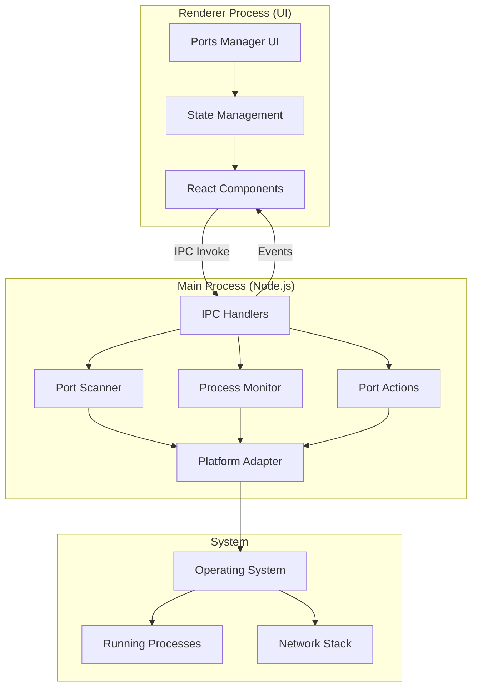

# Local Ports Manager - Design Document

## Overview

The Local Ports Manager is an Electron-based development tool that provides real-time monitoring and management of local network ports. The system follows Electron's multi-process architecture, with port scanning and process management handled in the main process (Node.js) and UI rendering in the renderer process (Chromium). Communication between processes uses Electron's IPC mechanism for security and performance.

The design emphasizes cross-platform compatibility, performance optimization through background scanning, and a responsive UI that doesn't block during intensive operations.

## Architecture

### High-Level Architecture



### Process Architecture

**Main Process Responsibilities:**

- Port scanning using native system commands
- Process information retrieval
- Process termination
- File system operations
- Background polling and monitoring

**Renderer Process Responsibilities:**

- UI rendering and user interactions
- State management
- Filtering and searching
- Clipboard operations
- Notifications

**IPC Communication:**

- Request/Response pattern for synchronous operations (get ports, kill process)
- Event-based pattern for real-time updates (port added, port removed)
- Streaming pattern for large datasets (initial port scan)

## Components and Interfaces

### 1. Port Scanner Service (Main Process)

**Purpose:** Detects active ports and extracts process information

**Interface:**

```typescript
interface PortScannerService {
  // Scan ports in specified range
  scanPorts(startPort: number, endPort: number): Promise<PortInfo[]>;

  // Scan common development ports (3000-9999)
  scanDevPorts(): Promise<PortInfo[]>;

  // Get information for a specific port
  getPortInfo(port: number): Promise<PortInfo | null>;

  // Start continuous monitoring
  startMonitoring(interval: number): void;

  // Stop continuous monitoring
  stopMonitoring(): void;
}

interface PortInfo {
  port: number;
  protocol: "TCP" | "UDP";
  processId: number;
  processName: string;
  commandLine: string;
  startTime: Date;
  state: "LISTEN" | "ESTABLISHED" | "CLOSE_WAIT" | string;
}
```

**Implementation Strategy:**

- Use platform-specific commands via child_process.exec
- Parse command output into structured PortInfo objects
- Cache results to minimize system calls
- Implement debouncing for rapid successive scans

### 2. Platform Adapter (Main Process)

**Purpose:** Abstracts platform-specific port detection and process management

**Interface:**

```typescript
interface PlatformAdapter {
  // Get command to list active ports
  getPortListCommand(startPort?: number, endPort?: number): string;

  // Parse platform-specific output into PortInfo
  parsePortOutput(output: string): PortInfo[];

  // Kill process by PID
  killProcess(pid: number, force?: boolean): Promise<boolean>;

  // Check if process requires elevated permissions
  requiresElevation(pid: number): Promise<boolean>;
}
```

**Platform Implementations:**

**macOS/Linux:**

- Command: `lsof -i -P -n` or `ss -tulpn`
- Parse output using regex patterns
- Kill using `process.kill()` with SIGTERM/SIGKILL

**Windows:**

- Command: `netstat -ano` combined with `tasklist`
- Parse output using regex patterns
- Kill using `taskkill /PID <pid> /F`

### 3. Process Monitor (Main Process)

**Purpose:** Tracks changes in port states and emits events

**Interface:**

```typescript
interface ProcessMonitor {
  // Start monitoring with specified interval
  start(intervalMs: number): void;

  // Stop monitoring
  stop(): void;

  // Get current snapshot
  getCurrentPorts(): PortInfo[];

  // Event emitters
  on(event: "port-added", callback: (port: PortInfo) => void): void;
  on(event: "port-removed", callback: (port: PortInfo) => void): void;
  on(event: "port-updated", callback: (port: PortInfo) => void): void;
}
```

**Implementation Strategy:**

- Maintain in-memory snapshot of current ports
- Compare new scans with previous snapshot
- Emit granular events for UI updates
- Use Set data structure for efficient diff operations

### 4. Framework Detector (Main Process)

**Purpose:** Identifies common development frameworks from process information

**Interface:**

```typescript
interface FrameworkDetector {
  // Detect framework from process info
  detectFramework(portInfo: PortInfo): FrameworkInfo | null;
}

interface FrameworkInfo {
  name: string;
  displayName: string;
  icon?: string;
  color?: string;
}
```

**Detection Patterns:**

```typescript
const FRAMEWORK_PATTERNS = [
  {
    pattern: /webpack.*dev.*server/i,
    name: "webpack",
    displayName: "Webpack Dev Server",
  },
  { pattern: /vite/i, name: "vite", displayName: "Vite Dev Server" },
  { pattern: /next.*dev/i, name: "nextjs", displayName: "Next.js Dev Server" },
  {
    pattern: /react-scripts.*start/i,
    name: "cra",
    displayName: "Create React App",
  },
  {
    pattern: /vue-cli-service.*serve/i,
    name: "vue",
    displayName: "Vue Dev Server",
  },
  { pattern: /ng.*serve/i, name: "angular", displayName: "Angular Dev Server" },
  {
    pattern: /manage\.py.*runserver/i,
    name: "django",
    displayName: "Django Dev Server",
  },
  { pattern: /flask.*run/i, name: "flask", displayName: "Flask Dev Server" },
  { pattern: /rails.*server/i, name: "rails", displayName: "Rails Server" },
  { pattern: /php.*-S/i, name: "php", displayName: "PHP Built-in Server" },
];
```

### 5. Port Actions Service (Main Process)

**Purpose:** Executes actions on ports and processes

**Interface:**

```typescript
interface PortActionsService {
  // Kill process using port
  killProcess(port: number, force?: boolean): Promise<ActionResult>;

  // Open port in browser
  openInBrowser(
    port: number,
    protocol?: "http" | "https"
  ): Promise<ActionResult>;

  // Check if port is available
  isPortAvailable(port: number): Promise<boolean>;
}

interface ActionResult {
  success: boolean;
  message?: string;
  error?: Error;
}
```

### 6. IPC Handlers (Main Process)

**Purpose:** Exposes main process functionality to renderer via IPC

**Channels:**

```typescript
// Request/Response channels
ipcMain.handle('ports:scan', async (event, range?: PortRange) => PortInfo[]);
ipcMain.handle('ports:get', async (event, port: number) => PortInfo | null);
ipcMain.handle('ports:kill', async (event, port: number) => ActionResult);
ipcMain.handle('ports:open-browser', async (event, port: number) => ActionResult);

// Event channels (main -> renderer)
mainWindow.webContents.send('ports:added', portInfo);
mainWindow.webContents.send('ports:removed', portInfo);
mainWindow.webContents.send('ports:updated', portInfo);

// Control channels
ipcMain.handle('ports:start-monitoring', async (event, interval: number) => void);
ipcMain.handle('ports:stop-monitoring', async () => void);
```

### 7. Ports Manager UI (Renderer Process)

**Purpose:** Displays ports and handles user interactions

**Component Structure:**

```
PortsManagerView
├── PortsToolbar
│   ├── SearchInput
│   ├── FilterDropdown
│   └── RefreshButton
├── PortsList
│   ├── VirtualScroller
│   └── PortItem[]
│       ├── PortBadge
│       ├── ProcessInfo
│       └── ActionButtons
└── PortDetailsPanel
    ├── ProcessDetails
    ├── ConnectionInfo
    └── ActionButtons
```

**State Management:**

```typescript
interface PortsState {
  ports: PortInfo[];
  selectedPort: number | null;
  filters: {
    search: string;
    portRange: [number, number] | null;
    protocol: "TCP" | "UDP" | "ALL";
  };
  isScanning: boolean;
  isMonitoring: boolean;
}
```

### 8. Notification Service (Renderer Process)

**Purpose:** Displays notifications for port events and conflicts

**Interface:**

```typescript
interface NotificationService {
  // Show notification
  show(notification: Notification): void;

  // Show port conflict notification
  showPortConflict(port: number, processName: string): void;
}

interface Notification {
  type: "info" | "warning" | "error" | "success";
  title: string;
  message: string;
  duration?: number;
  actions?: NotificationAction[];
}
```

## Data Models

### PortInfo Model

```typescript
interface PortInfo {
  // Core identification
  port: number;
  protocol: "TCP" | "UDP";

  // Process information
  processId: number;
  processName: string;
  commandLine: string;
  startTime: Date;

  // Network state
  state: "LISTEN" | "ESTABLISHED" | "CLOSE_WAIT" | string;
  localAddress?: string;
  remoteAddress?: string;

  // Framework detection
  framework?: FrameworkInfo;

  // Metadata
  lastSeen: Date;
  isNew?: boolean;
}
```

### PortRange Model

```typescript
interface PortRange {
  start: number;
  end: number;
  label?: string;
}

const COMMON_RANGES: PortRange[] = [
  { start: 3000, end: 3999, label: "Node.js (3000-3999)" },
  { start: 4200, end: 4299, label: "Angular (4200-4299)" },
  { start: 5000, end: 5999, label: "Flask/Python (5000-5999)" },
  { start: 8000, end: 8999, label: "Django/General (8000-8999)" },
  { start: 9000, end: 9999, label: "General Dev (9000-9999)" },
];
```

### Settings Model

```typescript
interface PortsManagerSettings {
  // Scanning
  scanInterval: number; // milliseconds
  defaultPortRange: PortRange;
  autoStartMonitoring: boolean;

  // UI
  showSystemPorts: boolean; // ports < 1024
  groupByFramework: boolean;
  theme: "light" | "dark" | "auto";

  // Notifications
  enableNotifications: boolean;
  notifyOnPortConflict: boolean;
  notifyOnNewPort: boolean;

  // Filters (persisted)
  lastSearch: string;
  lastProtocolFilter: "TCP" | "UDP" | "ALL";
}
```

## Error Handling

### Error Categories

**1. Permission Errors**

- Scenario: Insufficient permissions to scan ports or kill processes
- Handling: Display clear error message with instructions to run with elevated permissions
- Recovery: Offer to restart with elevated permissions (platform-specific)

**2. Platform Errors**

- Scenario: Platform command fails or returns unexpected output
- Handling: Log error details, fallback to alternative commands if available
- Recovery: Retry with exponential backoff, notify user if persistent

**3. Process Errors**

- Scenario: Unable to kill process or process doesn't exist
- Handling: Display specific error message (process protected, already terminated, etc.)
- Recovery: Refresh port list to show current state

**4. IPC Errors**

- Scenario: Communication failure between main and renderer
- Handling: Log error, attempt to re-establish connection
- Recovery: Reload renderer if connection cannot be restored

**Error Handling Strategy:**

```typescript
class PortsManagerError extends Error {
  constructor(
    message: string,
    public code: ErrorCode,
    public recoverable: boolean = true,
    public details?: any
  ) {
    super(message);
  }
}

enum ErrorCode {
  PERMISSION_DENIED = "PERMISSION_DENIED",
  PLATFORM_COMMAND_FAILED = "PLATFORM_COMMAND_FAILED",
  PROCESS_NOT_FOUND = "PROCESS_NOT_FOUND",
  PROCESS_PROTECTED = "PROCESS_PROTECTED",
  IPC_FAILURE = "IPC_FAILURE",
  SCAN_TIMEOUT = "SCAN_TIMEOUT",
}
```

## Testing Strategy

### Unit Tests

**Main Process Components:**

- Platform Adapter: Test command generation and output parsing for each platform
- Framework Detector: Test pattern matching against sample process data
- Port Scanner: Test port range validation and result formatting
- Process Monitor: Test diff algorithm and event emission

**Renderer Components:**

- UI Components: Test rendering with various port states
- State Management: Test filter logic and state updates
- Notification Service: Test notification display and actions

**Test Data:**
Create mock port data representing various scenarios:

- Common development servers (Node, Python, etc.)
- System services
- Multiple processes on same port (different protocols)
- Edge cases (high port numbers, unusual process names)

### Integration Tests

**IPC Communication:**

- Test request/response flow for all IPC channels
- Test event emission and handling
- Test error propagation across IPC boundary

**End-to-End Scenarios:**

- Scan ports and display results
- Kill process and verify port is freed
- Open browser and verify URL is correct
- Filter ports and verify results
- Monitor ports and verify real-time updates

### Platform-Specific Tests

**Test Matrix:**

- macOS: Test with lsof command
- Windows: Test with netstat and tasklist
- Linux: Test with both lsof and ss commands

**Mock System Commands:**
Use child_process mocking to simulate platform command outputs without requiring actual processes

### Performance Tests

**Benchmarks:**

- Port scanning speed (measure time for 1000 ports)
- UI rendering performance (measure FPS with 100+ ports)
- Memory usage during continuous monitoring
- IPC throughput (messages per second)

**Performance Targets:**

- Initial scan: < 1 second for dev port range (3000-9999)
- UI update: < 100ms after receiving new port data
- Memory: < 50MB additional memory for monitoring
- CPU: < 5% CPU usage during idle monitoring

## Security Considerations

### Process Termination

- Require confirmation before killing processes
- Detect system-critical processes and show additional warnings
- Log all process termination attempts
- Implement rate limiting to prevent abuse

### Command Injection Prevention

- Never use user input directly in system commands
- Validate all port numbers and PIDs
- Use parameterized commands where possible
- Sanitize all command output before parsing

### IPC Security

- Validate all IPC messages
- Implement message size limits
- Use contextIsolation in renderer process
- Disable nodeIntegration in renderer process

### Privilege Escalation

- Request elevated permissions only when necessary
- Clearly communicate why elevation is needed
- Provide option to continue with limited functionality
- Never store elevated credentials

## Performance Optimizations

### Scanning Optimization

- Scan only common dev ports by default (3000-9999)
- Implement parallel scanning for large port ranges
- Cache results with TTL to reduce system calls
- Use incremental scanning (check changed ports first)

### UI Optimization

- Implement virtual scrolling for large port lists
- Debounce search input (300ms)
- Memoize filtered results
- Use React.memo for port item components
- Lazy load port details panel

### Memory Management

- Limit port history to last 1000 entries
- Clear old notifications after 50 items
- Implement LRU cache for port info
- Release resources when monitoring stops

### IPC Optimization

- Batch port updates (send max every 500ms)
- Use structured clone for IPC messages
- Implement message compression for large datasets
- Use streams for initial port scan results

## Deployment Considerations

### Electron Packaging

- Include platform-specific binaries if needed
- Configure appropriate permissions in package.json
- Set up code signing for macOS and Windows
- Configure auto-updater for seamless updates

### Platform Requirements

- macOS: Requires macOS 10.13 or later
- Windows: Requires Windows 10 or later
- Linux: Requires glibc 2.28 or later

### Dependencies

- Electron: ^27.0.0
- React: ^18.0.0
- Node.js built-in modules: child_process, os, path
- No external native dependencies required

### Configuration

- Store settings in Electron's userData directory
- Support portable mode (settings in app directory)
- Provide CLI flags for advanced configuration
- Support environment variables for CI/CD
